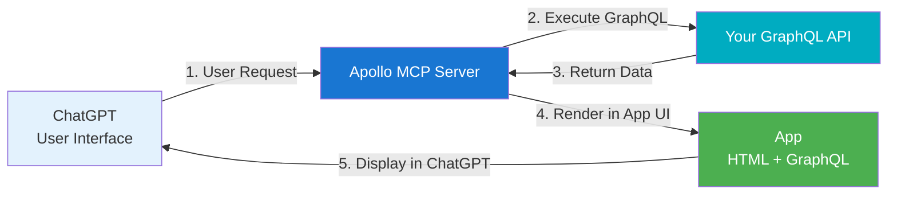
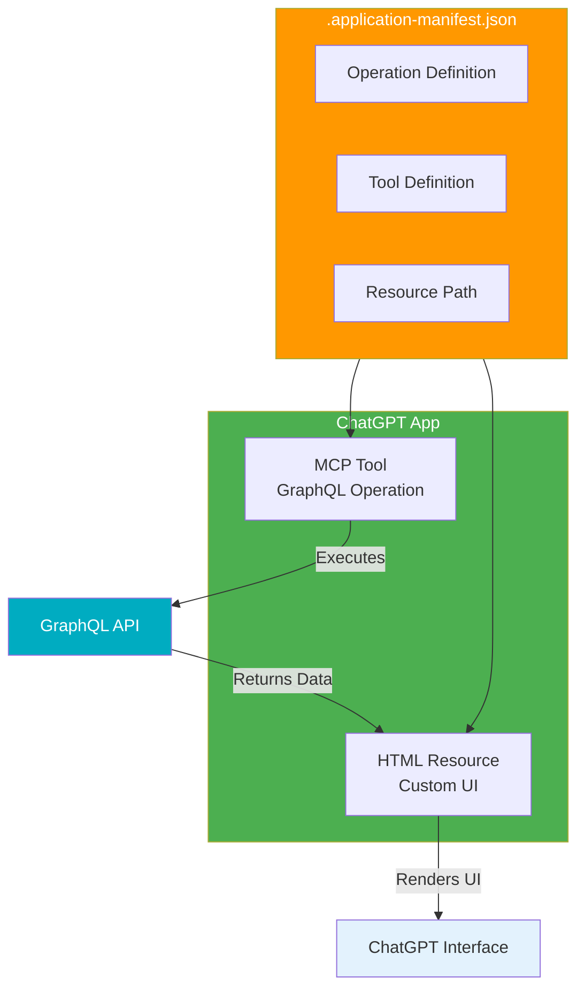

MCP Apps combine GraphQL operations with custom UI resources to create interactive experiences inside ChatGPT. Apollo MCP Server bridges your GraphQL APIs to OpenAI's Apps SDK.

## High-level flow

When ChatGPT invokes a tool, Apollo MCP Server executes the GraphQL operation, injects the results into your UI resource, and returns the rendered UI to ChatGPT.

## App components

An MCP App consists of:

- **Tools**: GraphQL operations exposed as MCP tools that ChatGPT can invoke
- **Resources**: UI files (HTML, React apps, or remote URLs) that render the data

The app manifest (`.application-manifest.json`) defines the mapping between tools, operations, and resources.

## App structure

Apps are organized in directories under `apps/`, each containing a manifest file and UI resources. The manifest defines GraphQL operations, tool mappings, and resource paths.

### Data access

Tool results are available in your UI via `window.toolResult`:
- Main result: `window.toolResult.result.data`
- Prefetch results: `window.toolResult.prefetch.prefetchID`

Prefetch operations run automatically when any tool in the app is invoked, useful for loading common data or user context.

## Resource types

Resources can be:
- **Local HTML files**: Stored in your app directory
- **React apps**: Built with Vite or other tools (recommended via [template](https://github.com/apollographql/ai-apps-template))
- **Remote URLs**: Hosted elsewhere and referenced by URL

## App target selection

Apollo MCP Server supports two app targets:
- **AppsSDK** (default): For OpenAI ChatGPT apps
- **MCPApps**: For MCP-compatible clients

The target determines MIME type, metadata format, and CSP format. For ChatGPT, use the default AppsSDK target.

## Next steps

- Review the [MCP Apps Overview](/apollo-mcp-server/apps-sdk) for key concepts
- Follow the [Quickstart guide](/apollo-mcp-server/apps-sdk-quickstart) to build your first app
- Explore the [MCP Apps Reference](/apollo-mcp-server/apps-sdk-reference) for detailed configuration
