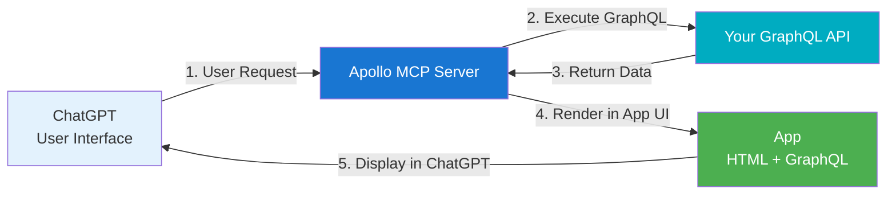

Apollo MCP Server supports [OpenAI's Apps SDK](https://developers.openai.com/apps-sdk) through MCP Apps, enabling you to build custom, interactive experiences directly inside ChatGPT. This integration allows you to control how results are displayed in ChatGPT, tailoring the look, feel, and interactivity of responses generated from your GraphQL APIs and agentic workflows.

## What are ChatGPT apps?

ChatGPT apps are mini applications that run inside ChatGPT. Unlike standard MCP tools that return text responses, apps give you complete control over how data appears in ChatGPT, enabling:

- **Custom visualizations**: Display data in tables, cards, charts, or any custom HTML layout
- **Interactive experiences**: Build forms, buttons, and interactive elements that users can interact with directly in ChatGPT
- **Unique experiences**: Create bespoke in-ChatGPT experiences that match your use-case
- **Rich UI beyond text**: Go beyond plain text responses with styled, interactive interfaces

## How MCP Apps work with Apollo MCP Server

Apollo MCP Server bridges your GraphQL APIs to OpenAI's Apps SDK through MCP Apps, allowing you to:

1. **Define GraphQL operations** that fetch data from your APIs
2. **Create UI resources** (HTML, React, or other web technologies) that control how that data is displayed in ChatGPT
3. **Package them together** as apps that ChatGPT can discover and use

<Note>

The easiest way to get started is to use the [Apollo AI Apps Template](https://github.com/apollographql/ai-apps-template), which provides a complete setup with React, Vite, Apollo Client, and Apollo MCP Server integration. See the [Quickstart guide](/apollo-mcp-server/apps-sdk-quickstart) for more information.

</Note>

## MCP Apps vs standard MCP tools

| Feature | Standard MCP Tools | MCP Apps |
|---------|-------------------|----------|
| **Response Format** | Plain text | Custom HTML/UI |
| **Display Control** | Limited to text formatting | Complete control over layout and styling |
| **Interactivity** | None | Full interactive capabilities |
| **Use Case** | Simple data retrieval | Rich experiences |
| **Best For** | Quick queries, simple responses | Complex visualizations, interactive workflows |

### When to use MCP Apps

Use MCP Apps when you need:

- **Display customization**: Control exactly how data appears in ChatGPT (e.g., property listings with images, product catalogs with cards)
- **Interactive experiences**: Build forms, buttons, or other interactive elements
- **Unique experiences**: Create custom UI elements
- **Complex visualizations**: Display data in tables, charts, or other structured formats

## Architecture

MCP Apps combine GraphQL operations with custom UI resources to create interactive experiences. Learn more about how MCP Apps work in the [Architecture guide](/apollo-mcp-server/apps-sdk-architecture).

## Prerequisites

Before building your first MCP App, ensure you have all the required prerequisites. See the [MCP Apps Prerequisites](/apollo-mcp-server/apps-sdk-prerequisites) page for a complete checklist.

## Get started

Ready to build your first ChatGPT app? Follow our [MCP Apps Quickstart](/apollo-mcp-server/apps-sdk-quickstart) to create your first app in minutes.

For detailed information about app structure, manifests, and configuration, see the [MCP Apps Reference](/apollo-mcp-server/apps-sdk-reference).
