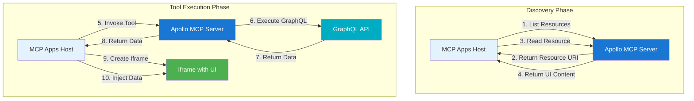

MCP Apps combine GraphQL operations with custom UI resources to create interactive experiences in MCP Apps-compatible hosts. Apollo MCP Server bridges your GraphQL APIs to the MCP Apps specification.

## High-level flow

MCP Apps work in two phases:

**Discovery phase**: The host discovers your app and pre-fetches the built resource.

**Tool execution phase**: When a tool is invoked, the host receives data from the MCP server and injects it into a pre-loaded iframe.

When an MCP Apps-compatible host invokes a tool, Apollo MCP Server executes the GraphQL operation and returns only the data. The host then creates an iframe with the pre-fetched HTML resource and injects the tool result data into it.

## App components

An MCP App consists of:

- **Tools**: GraphQL operations exposed as MCP tools that MCP Apps-compatible hosts can invoke
- **Resource**: The built `.html` file that contains your application code.

The app manifest (`.application-manifest.json`) is automatically generated from your app code and your configuration file (or `package.json`). GraphQL operations come from your app code, while app-level configuration comes from your configuration files. The manifest defines the mapping between tools, operations, and the resource.

## App structure

Apps are organized in directories under `apps/`, each containing build artifacts (the manifest file and built resources). The MCP Server reads from the `apps/` directory.

**Important**: The `apps/` directory contains build artifacts, not your development code. Development happens in a separate directory (we recommend using `dev/<app-name>`, like the [Apollo AI Apps Template](https://github.com/apollographql/ai-apps-template) does).

## Resources

The resource is the built `.html` file that contains your application code. This file is loaded by the host and contains everything needed to render your app's UI. We recommend using the [Apollo AI Apps Template](https://github.com/apollographql/ai-apps-template) for a complete setup.

## App target selection

Apollo MCP Server supports two app targets:
- ChatGPT Apps: For hosts that support OpenAI's Apps SDK specification (for example, ChatGPT)
- MCP Apps: MCP Apps-compatible clients

The target determines MIME type, metadata format, and CSP format.
