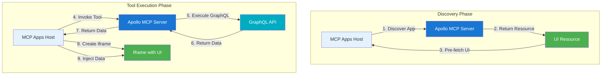
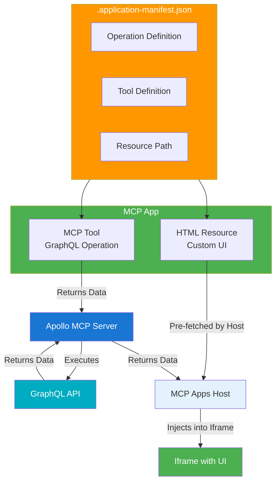

MCP Apps combine GraphQL operations with custom UI resources to create interactive experiences in MCP Apps-compatible hosts. Apollo MCP Server bridges your GraphQL APIs to the MCP Apps specification.

## High-level flow

MCP Apps work in two phases:

**Discovery phase**: The host discovers your app and pre-fetches the UI resource.

**Tool execution phase**: When a tool is invoked, the host receives data from the MCP server and injects it into a pre-loaded iframe.

When an MCP Apps-compatible host invokes a tool, Apollo MCP Server executes the GraphQL operation and returns only the data. The host then creates an iframe with the pre-fetched UI resource and injects the tool result data into it via `window.toolResult`.

## App components

An MCP App consists of:

- **Tools**: GraphQL operations exposed as MCP tools that MCP Apps-compatible hosts can invoke
- **Resource**: The UI for your app, specified as a URL

The app manifest (`.application-manifest.json`) is automatically generated from your app code and `package.json`. It defines the mapping between tools, operations, and the resource.

## App structure

Apps are organized in directories under `apps/`, each containing your app code, `package.json`, and the resource. The manifest file is automatically generated from these sources and defines GraphQL operations, tool mappings, and resource paths.

## Resources

The resource is the UI for your app, specified as a URL. This can point to a local file, a built React app, or a remote URL. We recommend using the [Apollo AI Apps Template](https://github.com/apollographql/ai-apps-template) for a complete setup.

## App target selection

Apollo MCP Server supports two app targets:
- **AppsSDK** (default): For hosts that support OpenAI's Apps SDK specification (for example, ChatGPT)
- **MCPApps**: MCP Apps-compatible clients

The target determines MIME type, metadata format, and CSP format. For ChatGPT and other Apps SDK-compatible hosts, use the default AppsSDK target.

## Next steps

- Review the [MCP Apps Overview](/apollo-mcp-server/mcp-apps) for key concepts
- Follow the [Quickstart guide](/apollo-mcp-server/mcp-apps-quickstart) to build your first app
- Explore the [MCP Apps Reference](/apollo-mcp-server/mcp-apps-reference) for detailed configuration
