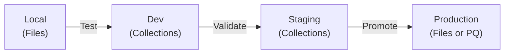

This guide outlines how to test changes to your Apollo MCP Server locally, in lower environments, and deploy to production. It connects the existing documentation into a coherent workflow.

## Workflow Overview



## Local Development

**Define operations:** Create `.graphql` operation files locally.

See [Define Tools > From operation files](/apollo-mcp-server/define-tools#from-operation-files) for details on operation syntax and structure.

**Run locally:** Use `rover dev` to run your MCP server alongside your GraphQL API.

```bash
rover dev --supergraph-config supergraph.yaml --mcp .apollo/mcp.local.yaml
```

See [Run the MCP Server](/apollo-mcp-server/run) for configuration options.

**Test:** Use MCP Inspector or connect an AI agent to test your operations.

See [Quickstart > Step 3](/apollo-mcp-server/quickstart#step-3-connect-to-an-mcp-client) for client connection examples.

## Dev and Staging Environments

**Create variants:** Set up separate [GraphOS graph variants](/graphos/platform/graph-management/variants) for dev and staging.

**Publish schema:** Publish your schema to each variant using `rover`.

**Manage operations:** Use [Operation Collections](/apollo-mcp-server/define-tools#from-operation-collections) in GraphOS Studio to define and organize operations per variant. Collections are fast to manage and don't require code commits.

See [Define Tools > From operation collections](/apollo-mcp-server/define-tools#from-operation-collections) for details on creating and managing collections.

**Deploy:** Deploy your MCP server pointing to each variant.

See [Deploy the MCP Server](/apollo-mcp-server/deploy) for deployment options and configuration.

**Test:** Connect your AI agent to each environment and validate behavior.

## Production Deployment

For production, choose an operation source:

**Option A: Local files (version-controlled)**
- Store operations in your git repository
- Operations are reviewed in PRs before deployment
- Use CI/CD to validate and deploy
- See [Define Tools > From operation files](/apollo-mcp-server/define-tools#from-operation-files)

**Option B: Persisted Queries (enterprise safelisting)**
- Publish operations to a [Persisted Query List](/graphos/platform/security/persisted-queries)
- Router enforces that only registered operations execute
- Use CI/CD to publish operations to the PQL
- See [Define Tools > From GraphOS-managed persisted queries](/apollo-mcp-server/define-tools#from-graphos-managed-persisted-queries)

**Configure authentication:** Use OAuth 2.1 for production authentication.

See [Authorization](/apollo-mcp-server/auth) for configuration.

**Disable introspection:** Disable introspection tools in production to reduce attack surface.

See [Config Reference > Introspection](/apollo-mcp-server/config-file#introspection) for options.

**Deploy:** Container-based deployment to your infrastructure.

See [Deploy the MCP Server](/apollo-mcp-server/deploy) for platform-specific guidance.

## Monitoring

Monitor your production MCP server using:

- **GraphOS Studio:** View operation metrics and usage patterns in [Insights](/graphos/platform/insights)
- **OpenTelemetry:** Instrument for traces, metrics, and logs

See [Telemetry](/apollo-mcp-server/telemetry) for configuration.

## Summary

1. **Local:** Define operations as files, test with `rover dev` and AI agents
2. **Dev/Staging:** Publish schema to variants, manage operations in Collections, deploy and test
3. **Production:** Choose operation source (files or PQ), configure security, deploy, monitor

For detailed configuration examples and troubleshooting, see the [configuration reference](/apollo-mcp-server/config-file) and [best practices](/apollo-mcp-server/best-practices).
